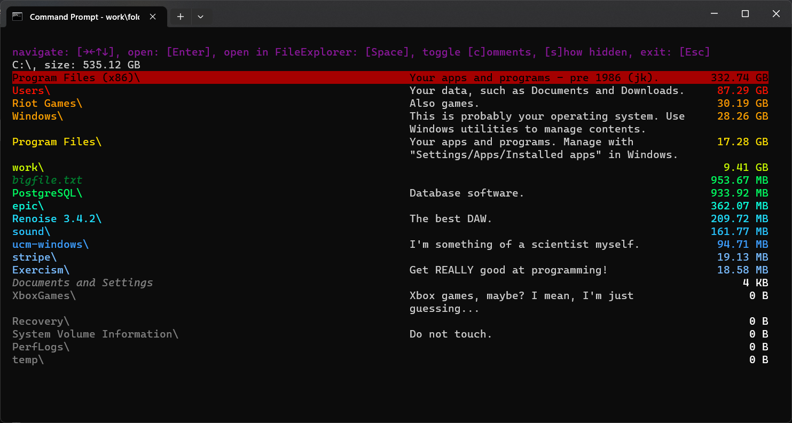
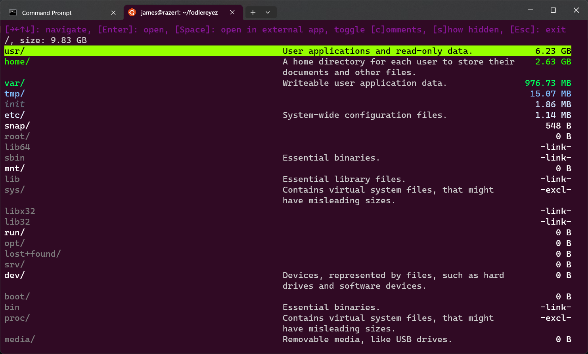

# FodlerEyez

### Welcome to the last text UI, folder and file size utility, for gamers, on Windows, with sarcastic comments, you will ever need (maybe).



1. [ ] Fodlereyez is colourful!

2.[ ] Fodlereyez is helpful!

3.[ ] Fodlereyez is a text based UI app, that shows your files and folders sorted by size, and
  coloured depending on their absolute size. So directories containing lots of data, or large
  files, are red and small files, or directories containing little data, are white/blue. (Because
  Windows FileExplorer doesn't show directory size in a column; you have to open each individual
  directory's properties)

4.[ ] Fodlereyez also has helpful / annoying / cringe comments on your folders and files, as
  shown in the
  image above.

You can turn off comments, and show hidden files and folders with either command line arguments
or ui commands as shown in the image below:



You can drill down into subdirectories by left-clicking their name, or by selecting them using
the arrow keys and pressing [Enter].

Pressing [Space] with an entry highlighted will open that entry in FileExplorer in order to make
changes, such as deleting unnecessary files or folders.

[Esc] will exit the app.

You invoke Fodlereyez from a command prompt, passing the directory you want to start from as the
argument. E.g.

```
c:\Users\james>fodlereyez.exe c:\
```

Take a look at available options using `--help`

```
c:\Users\james>fodlereyez.exe --help
```

If you are interested, there is a readme about the dev process and why I made this project
[here](DEV_README.md)
